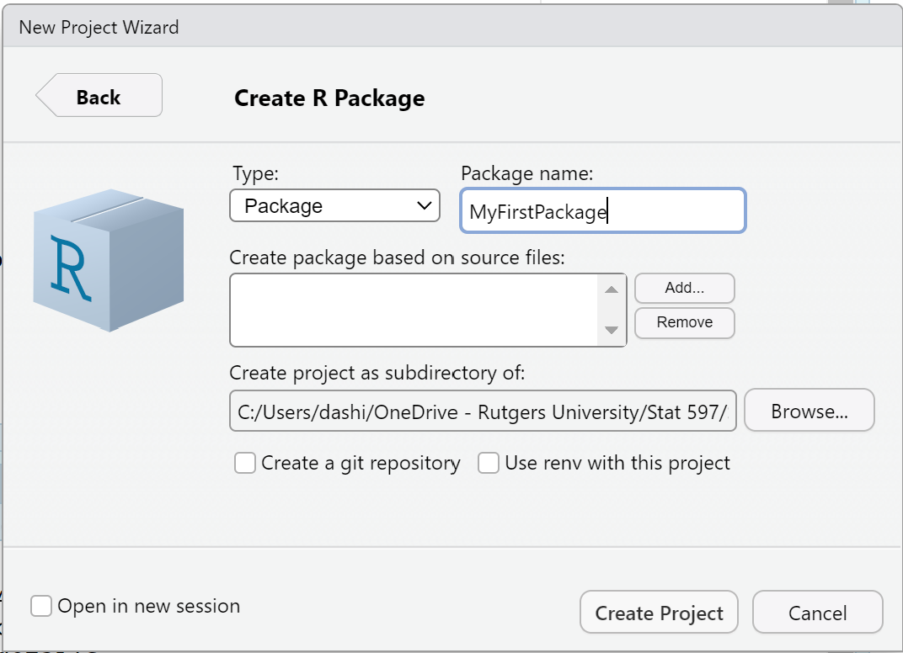
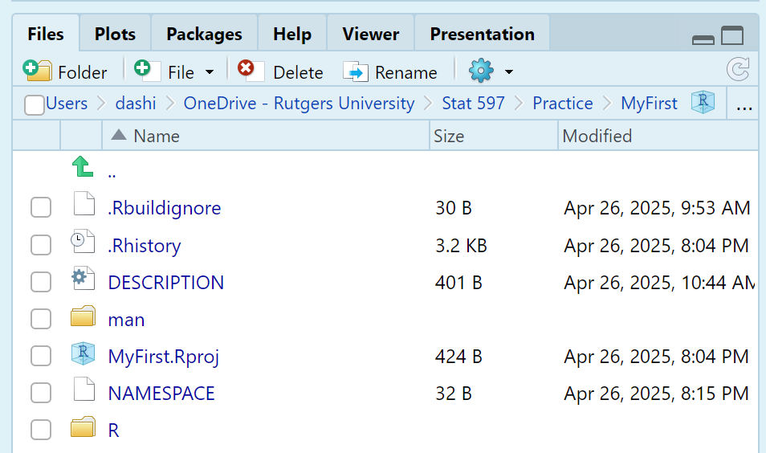
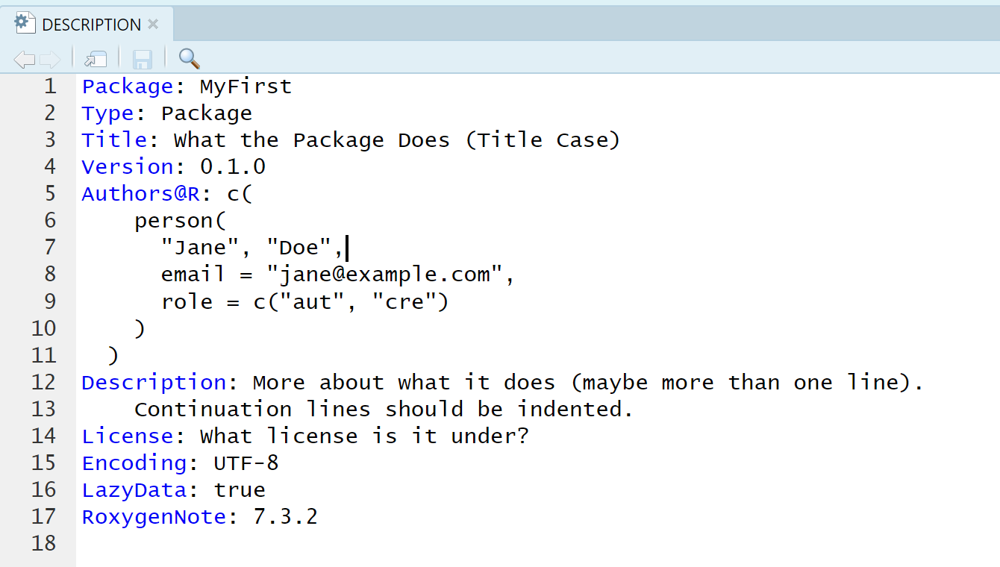
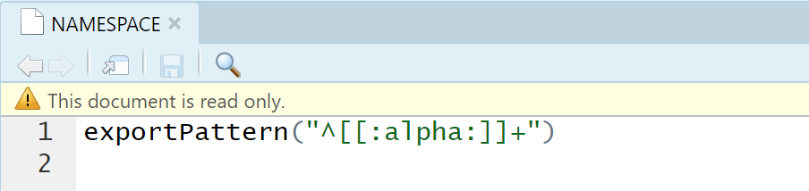
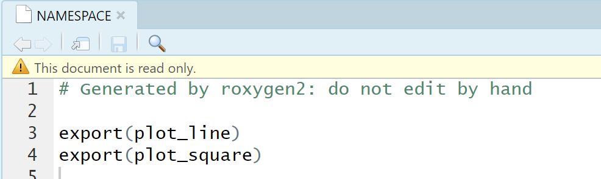
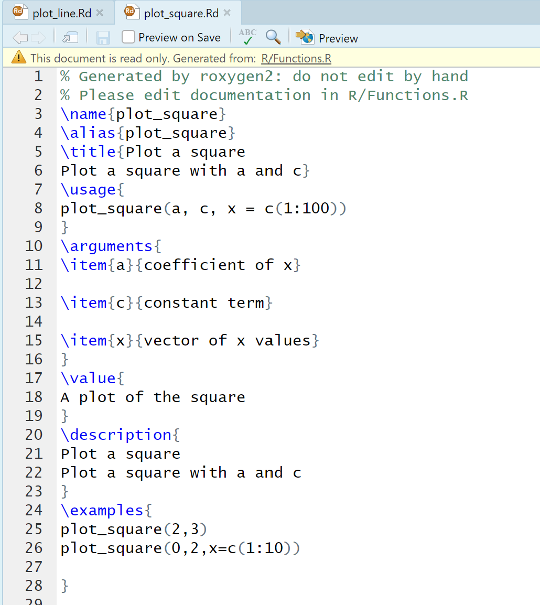
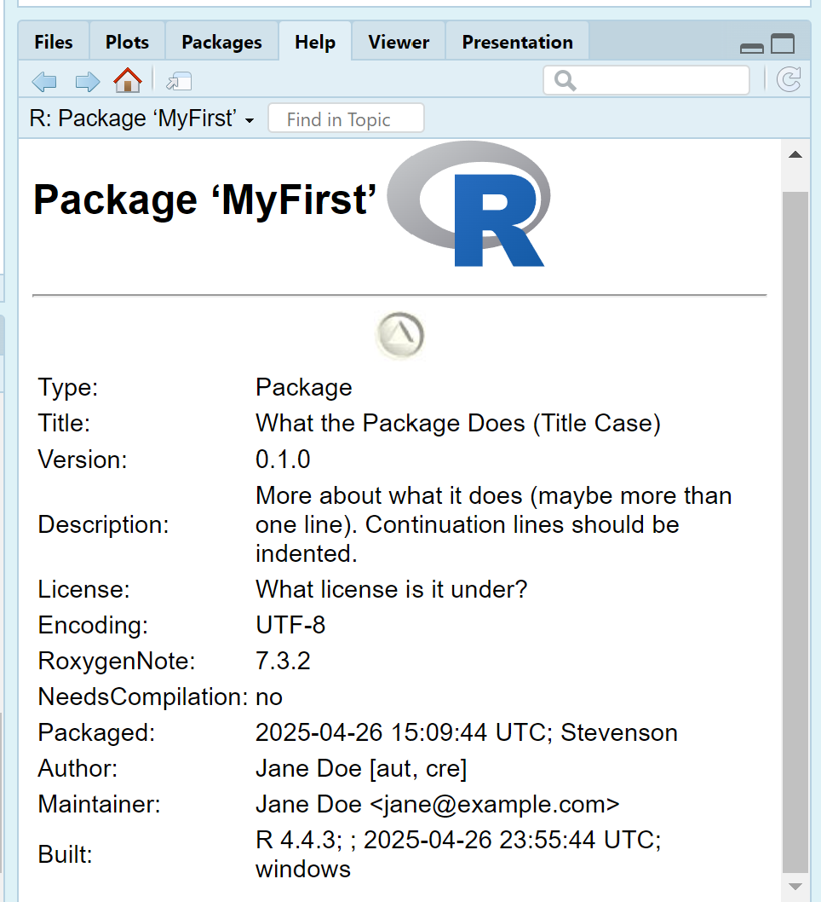
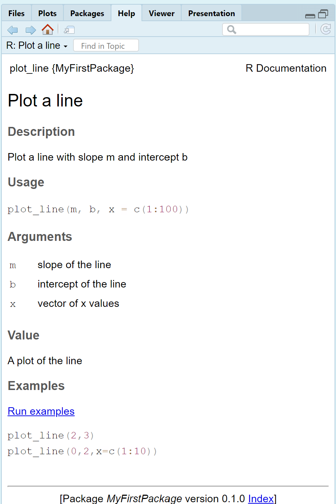
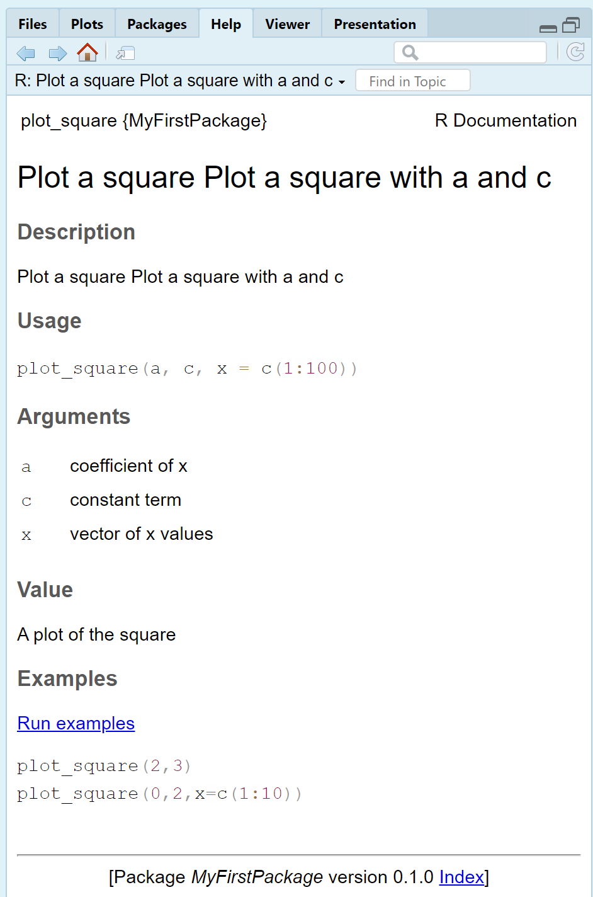

```{r setup, include=FALSE}
knitr::opts_chunk$set(echo = TRUE)
knitr::opts_chunk$set(
  tidy = TRUE,    # tidy=TRUE wraps the code nicely
  tidy.opts = list(arrow=TRUE, indent=2,width.cutoff = 60) # wrap after 60 characters
)
```


# Introduction to R Packages
## What is an R Package?

- A structured collection of R functions, data, and documentation.
- Organized with files like `DESCRIPTION`, `R/`, `man/`, `data/`.
- Allows easy sharing, installation, and reuse of code.

## How to Create an R Package

- Set up folder structure manually or with `usethis::create_package()`.
- Write and organize functions under `R/`.
- Add metadata in the `DESCRIPTION` file.
- Document functions using `roxygen2` or `.Rd` files.
- Test, build, and install using tools like `devtools`.

## Advantages

- Promotes code reuse and standardization.
- Improves collaboration and reproducibility.
- Enhances visibility of research and tools.
- Facilitates maintenance and scaling of codebases.

## Disadvantages

- Requires time and effort to learn best practices.
- Maintenance over time is necessary.
- CRAN submission can be demanding.
- Poor maintenance can lead to user errors and reputational risks.

# First Steps in Package Development
## Setting Up the Package Structure
::: {.columns}
::: {.column width="50%"}
\scriptsize
```{r , eval=FALSE,tidy.opts=list(width.cutoff = 60)}
# Load necessary packages
library(usethis)
library(devtools)
# Create a new package
create_package("myPackage")
# Create a new package with a specific path
create_package("path/to/myPackage")
# Create a new package with a specific path and description
create_package("path/to/myPackage", 
               description = list(Title = "My Package",
                                  Description = "A package for demonstration purposes.",
                                  Version = "0.1.0",
                                  Author = "Your Name",
                                  License = "Rutgers University"
                                  )
               )
```
:::

::: {.column width="50%"}


:::
:::
## Setting Up the Package Structure
::: {.columns}
::: {.column width="50%"}
\scriptsize
```{r, eval=FALSE,tidy.opts=list(width.cutoff = 60)}
# Load necessary packages
library(usethis)
library(devtools)
# Create a new package
create_package("myPackage")
# Create a new package with a specific path
create_package("path/to/myPackage")
# Create a new package with a specific path and description
create_package("path/to/myPackage", 
               description = list(Title = "My Package",
                                  Description = "A package for demonstration purposes.",
                                  Version = "0.1.0",
                                  Author = "Your Name",
                                  License = "Rutgers University"
                                  )
               )
```
:::

::: {.column width="50%"}


:::
:::

## Setting the files inside the package
::: {.columns}
::: {.column width="50%"}

:::

::: {.column width="50%"}




:::
:::

## Create the functions inside the foldet R
\scriptsize
```{r,eval=FALSE}
# Function to plot a line
plot_line <- function(m,b,x=c(1:100)){
  y = m*x + b
  plot(x,y,type="l",col="blue",xlab="x",ylab="y")
  title("Line Plot")
}

#Function to plot a square
plot_square <- function(a,c,x=c(1:100)){
  y = (a+x)^2 + c
  plot(x,y,type="l",col="red",xlab="x",ylab="y")
  title("Square Plot")
}
```

## Create the documentation
::: {.columns}
::: {.column width="50%"}
\scriptsize
```{r,eval=FALSE}
#'Plot a line
#'
#'@description
#' Plot a line with slope m and intercept b
#'@param m slope of the line
#'@param b intercept of the line
#'@param x vector of x values
#'
#'@examples
#' plot_line(2,3)
#' plot_line(0,2,x=c(1:10))
#'
#'@return A plot of the line
#'
#'@export
plot_line <- function(m,b,x=c(1:100)){
  y = m*x + b
  plot(x,y,type="l",col="blue",xlab="x",ylab="y")
  title("Line Plot")
}
```
:::

::: {.column width="50%"}
\scriptsize
```{r, eval=FALSE}
#'Plot a square
#'Plot a square with a and c
#'@param a coefficient of x
#'@param c constant term
#'@param x vector of x values
#'
#'@examples
#' plot_square(2,3)
#' plot_square(0,2,x=c(1:10))
#'
#' @return A plot of the square
#'
#'
#'@export
plot_square <- function(a,c,x=c(1:100)){
  y = (a+x)^2 + c
  plot(x,y,type="l",col="red",xlab="x",ylab="y")
  title("Square Plot")
}
```
:::
:::

## Create the documentation  in the Rd files
::: {.columns}
::: {.column width="50%"}
\scriptsize
```{r,eval=FALSE}
# Load the devtools package, which helps to create the package
library(devtools) 

# Load the roxygen2 package, which helps to create the documentation
library(roxygen2) 

# Load the package
load_all() 

# Create the documentation
roxygenise() 
```
:::
::: {.column width="40%"}

:::
:::

## Data inside the package
::: {.columns}
::: {.column width="50%"}
\scriptsize
```{r,eval=FALSE}
# Create a data frame
my_data <- data.frame(
  x = c(1, 2, 3, 4, 5),
  y = c(2, 4, 6, 8, 10)
)

#or load it from a csv file
my_data <- read.csv("data/my_data.csv")

# Save the data frame as an R object, .rda file
usethis::use_data(my_data, overwrite = TRUE)
```
:::
::: {.column width="50%"}
\scriptsize
```{r,eval=FALSE}
#' @title Example Data: my_data
#' @name my_data
#' @docType data
#' @usage data(my_data)
#' @format A data frame with 10 rows and 2 columns:
#' \describe{
#'   \item{x}{A numeric vector of values 1 to 10.}
#'   \item{y}{A numeric vector of random values.}
#' }
#' @source Created with data.frame function.
#' @export
#' @examples
#' # Load the data
#' data(my_data)
#' # View the first few rows
#' head(my_data)
"my_data"
```
:::
:::

# Create the package
## Two main alternatives
::: {.columns}
::: {.column width="50%"}
### Create and install a tar.gz file
\scriptsize
```{r,eval=FALSE}
#Create the package
build()

#Install the package
install.packages("../MyFirstPackage_0.1.0.tar.gz", repos = NULL, type = "source")

#Load the package
library(MyFirstPackage)

# Check the package documentation
help(package="MyFirstPackage")
```
:::

::: {.column width="50%"}
### Using GitHub
Projects can be created in GitHub and then downloaded to your computer
\scriptsize
```{r,eval=FALSE}
# Load to your Github account your package (project)
library(usethis)
use_git()
use_github()

# Install the package from your Github account
library("devtools")

#install_github("github_user_name/github_repo_name")
install_github("StevensonBolivar/MyFirstPackage")

# Check the package documentation
help(package="MyFirstPackage")
```
:::
:::

# Use the package
## Load the package
::: {.columns}
::: {.column width="50%"}
\scriptsize
```{r,eval=FALSE}
# Load the package
library(MyFirstPackage)
# Check the package documentation
help(package="MyFirstPackage")
```
:::
::: {.column width="40%"}

:::
:::

## Use the functions
```{r,include=FALSE}
library(MyFirstPackage)
```
::: {.columns}
::: {.column width="50%"}
\scriptsize
```{r}
# Use the functions
plot_line(2,3)
```
:::
::: {.column width="50%"}
\scriptsize
```{r}
# Use the functions
plot_square(2,3)
```
:::
:::

## Use the functions
```{r,include=FALSE}
library(MyFirstPackage)
```
::: {.columns}
::: {.column width="50%"}
\scriptsize
```{r}
# Use the functions
plot_line(20,3,x=1:10)
```
:::
::: {.column width="50%"}
\scriptsize
```{r}
# Use the functions
plot_square(-5,3,x=1:10)
```
:::
:::

## Help for the functions
::: {.columns}
::: {.column width="50%"}
\scriptsize
```{r,eval=FALSE}
# Help for the functions
?plot_line
```

:::
::: {.column width="50%"}
\scriptsize
```{r,eval=FALSE}
# Help for the functions
?plot_square
```

:::
:::

# References
## References
- Support Posit. Developing packages with the RStudio IDE. Retrieved from
[https://support.posit.co/hc/en-us/articles/200486488-Developing-Packages-with-the-RStudio-IDE](https://support.posit.co/hc/en-us/articles/200486488-Developing-Packages-with-the-RStudio-IDE)


